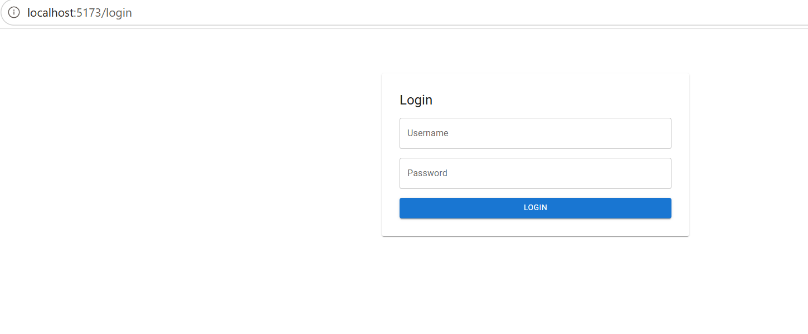
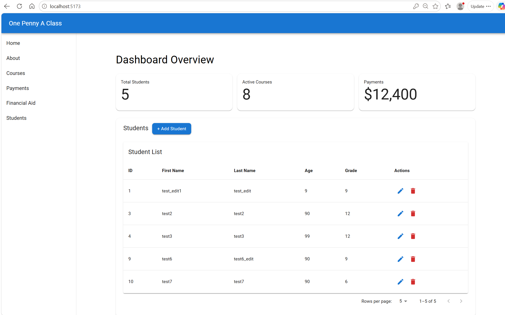
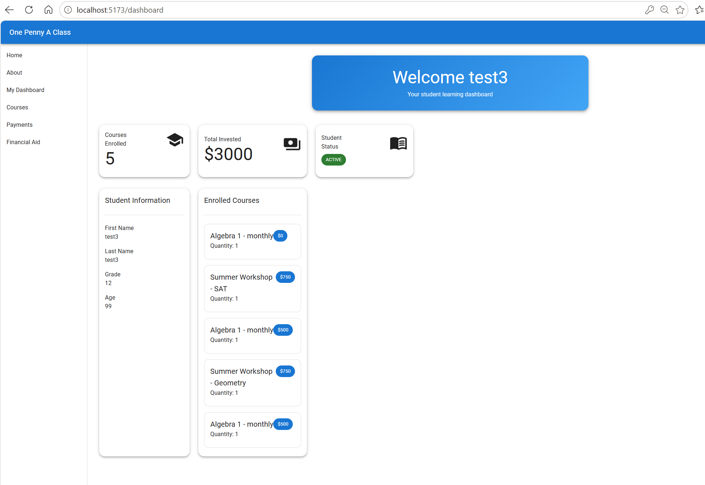
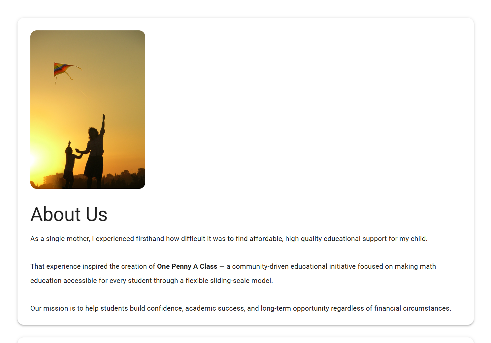
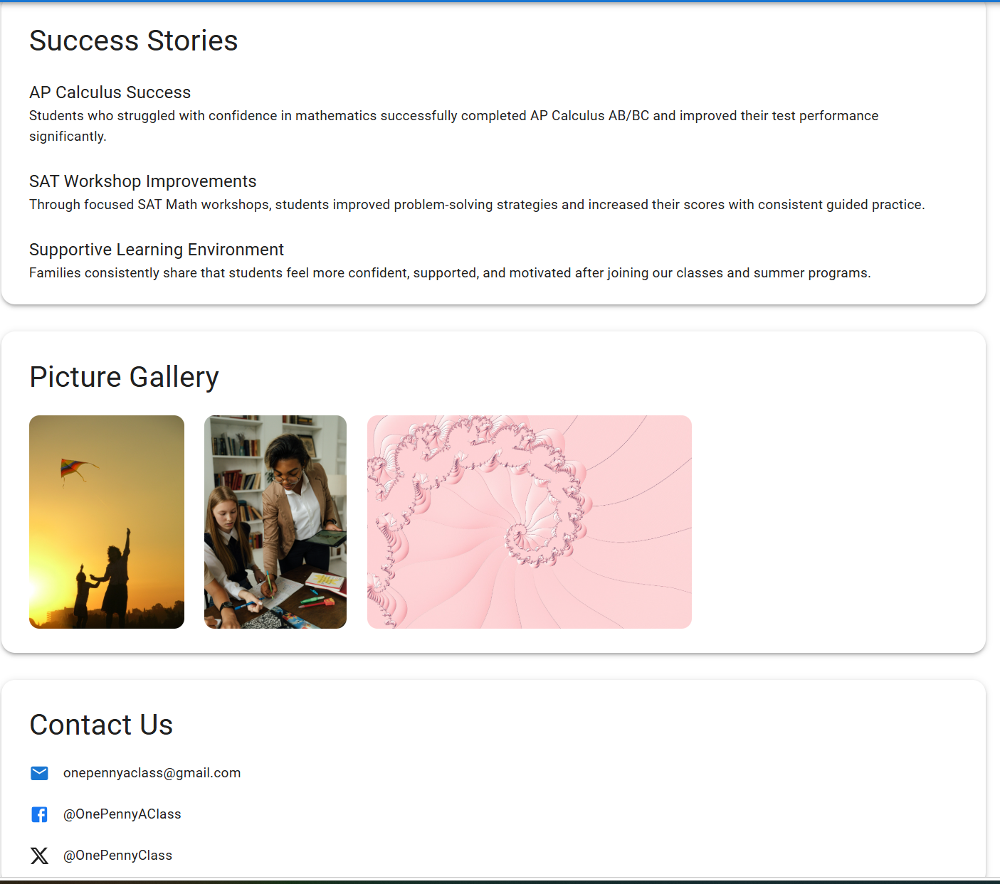
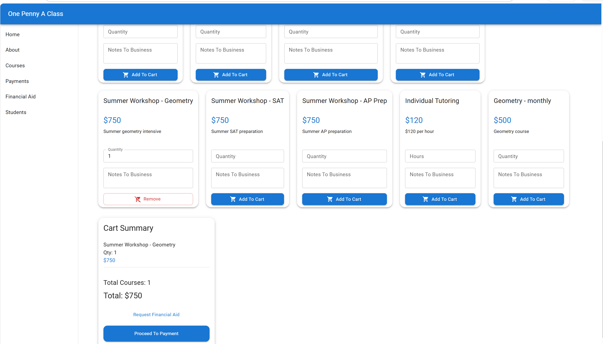
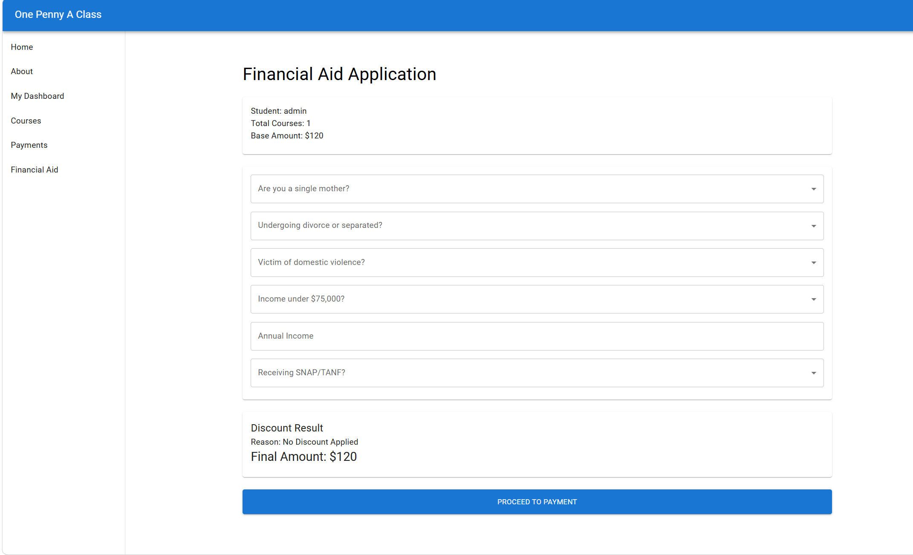
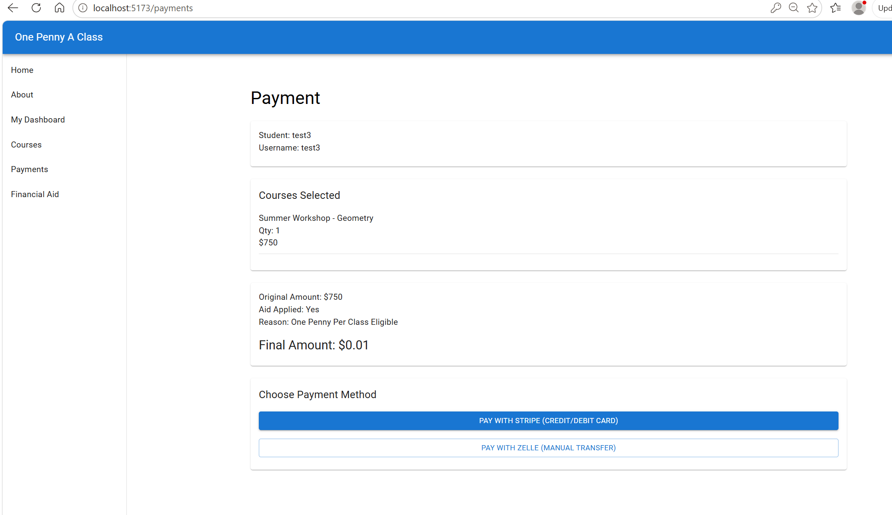

# One Penny A Class

A full-stack education platform that simulates a real-world SaaS learning system with enrollment, financial aid, payments, and role-based dashboards.

---

# System Overview

This application allows:
- Students to enroll in courses
- Apply for financial aid (income + eligibility rules)
- Receive discounted pricing logic
- Process enrollment through backend API
- View personalized dashboards
- Admin users to view all student data

---

# Architecture

This is a **Client-Server RESTful Architecture**:

### Frontend (Client)
- React (Vite)
- Material UI (MUI)
- React Router
- State via React + LocalStorage
- Runs on: `http://localhost:5173`

### Backend (Server)
- ASP.NET Core Web API (REST API)
- Entity Framework Core (ORM)
- SQL Server Database
- Runs on: `https://localhost:7263`

---

# System Flow
User Login → Home → Courses Page → Cart → Financial Aid (optional) → Enrollment API → Payment Page → Dashboard(Student role) → Students(Admin role)

---

# Key Features

## Authentication & Roles
- Role-based access (Student / Admin)
- Students see only their own data
- Admin can view all students

---

## Course Enrollment
- Add/remove courses from cart
- Quantity + notes support
- Enrollment stored in SQL Server via EF Core

---

## Financial Aid System
- Income-based eligibility rules
- Special conditions (single mother, domestic violence, TANF/SNAP)
- Dynamic discount calculation
- Stores:
  - original price
  - final discounted price
  - reason for discount

---

## Payment System (Simulation Ready)
- Stripe-ready structure (future integration)
- Zelle/manual payment option
- Final calculated price displayed after aid

---

## Dashboard (Student View)
- Total courses enrolled
- Total invested amount
- List of enrolled courses
- Payment summary
- Role-based personalized view

---

## Admin Panel
- View all students
- View enrollments
- Future: analytics dashboard

---

# Backend Structure

- Controllers:
  - AuthController
  - CoursesController
  - EnrollmentController
  - DashboardController
  - StudentsController

- Services:
  - IStudentService.cs
  - JwtService.cs
  - StudentService.cs

- Data:
  - AppDbContext

- DTOs:
  - CreateStudentDTO
  - CourseEnrollmentDto
  - StudentDashboardDto
  - EnrollmentRequestDto
  - LoginDTO
  - LoginResponseDTO
  - StudentRequestDTO
  - UpdateStudentDTO

- Models:
  - AppUser
  - Student
  - Course
  - StudentCourse (junction table)

- Middleware:
  - Exception Middleware

- Migrations:
  - InitialCreate

- Logs:
  - log-20260523.txt

- Program.cs

- appsettings.json
 

---

# Database

- Entity Framework Core migrations used
- Tables auto-generated from models
- SQL Server as persistent storage

---

# Logging

- Serilog used for structured logging
- Logs API requests and errors
- Helps debugging enrollment/payment flow

---

# Setup Instructions

## Frontend

npm install
npm run dev
npm install @mui/material @emotion/react @emotion/styled
npm install @mui/icons-material
http://localhost:5173

## Backend
dotnet restore
dotnet run
https://localhost:7263

Development Notes
EF Core migrations used for DB schema updates
API tested via Swagger + React frontend
LocalStorage used for temporary checkout state
Financial aid merges with checkout pipeline before payment

Future Enhancements
Stripe live payment integration
Zelle API automation
Email receipts (SendGrid)
Real authentication (JWT)
Admin analytics dashboard
Cloud deployment (Azure / AWS)
Multi-course bundles + coupons

## Screenshots

### Login

### Home

### Dashboard

### About

### Courses Page

### Financial Aid

### Payment Page

